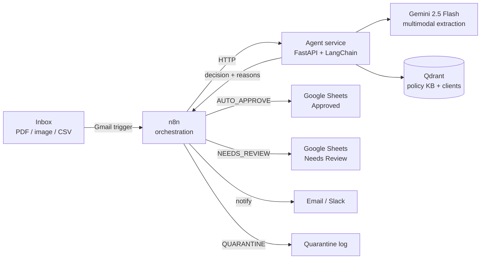

# Contract Intake & Triage Agent

> An agentic pipeline that ingests contracts from email, extracts structured data with an LLM, validates that data against an internal policy knowledge base (RAG), and routes each contract to automated storage or human review based on confidence and policy compliance.

**Stack:** Python (FastAPI + LangChain) · Gemini 2.5 Flash · Qdrant · n8n · Google Sheets · Docker Compose

---

## Why contracts?

The brief asked for a scenario that shows *thinking*, not a ready-made template. Contracts are a strong fit because the knowledge-base step does real work rather than acting as decoration: every extracted clause is checked against an internal **contract playbook** (acceptable term ranges, approved jurisdictions, renewal-notice limits), and every counterparty is cross-referenced against a **known-clients** list. A contract gets flagged *because* of a rule in the knowledge base — the RAG layer is the decision driver, not an add-on.

---

## How it works

```
Email + attachment  →  Extraction  →  RAG validation  →  Triage decision  →  Action
   (n8n trigger)       (Gemini)       (Qdrant + KB)      (decision engine)   (Sheets / review)
```

1. **Email intake.** A dedicated inbox is polled by an n8n Gmail trigger. New emails with a PDF, image, or CSV attachment kick off the workflow. (Polling means no public webhook/tunnel is required for a local run.)
2. **Extraction.** The attachment is sent to Gemini 2.5 Flash, which is natively multimodal — it reads clean PDFs, scanned/photographed images, and CSVs without a separate OCR step. The agent returns a structured JSON object where every field carries a `value`, a `confidence` score, and a `source_snippet` showing where in the document the value came from.
3. **RAG validation.** Each extracted term is checked against the knowledge base in Qdrant: policy rules (e.g. "auto-renewal notice must be ≤ 60 days"), approved jurisdictions, and the known-clients register. This is where the agent enriches and validates rather than just transcribes.
4. **Triage decision.** A decision engine combines field completeness, per-field confidence, policy compliance, and counterparty status into one of three outcomes — `AUTO_APPROVE`, `NEEDS_REVIEW`, or `QUARANTINE` — each with structured, human-readable reasons.
5. **Action.** High-confidence, compliant contracts are written to an "Approved" Google Sheet. Anything uncertain or non-compliant goes to a "Needs Review" sheet with the specific reasons attached, and a notification is sent. Unreadable files are quarantined.

---

## Architecture



**Separation of concerns:** n8n owns orchestration and integrations (triggers, branching, Sheets, notifications). The Python agent owns the AI logic (parsing, extraction, RAG, the decision engine). They communicate over HTTP on the local Docker network. This keeps the testable, reviewable logic in code while still producing the n8n workflow export the brief asks for.

---

## Tech stack & why

| Layer | Choice | Why |
|---|---|---|
| LLM | Gemini 2.5 Flash | Generous free tier; **natively multimodal** so it handles scanned images and PDFs without separate OCR. |
| Embeddings | Gemini embeddings | Free; keeps the stack on one provider. |
| Vector store | Qdrant (self-hosted) | Open-source and free; runs in the same Docker Compose, no external account, no inactivity timeout. |
| Orchestration | n8n (self-hosted) | Free; visual workflow doubles as a required deliverable. |
| Agent core | FastAPI + LangChain | Clean, typed, unit-testable AI logic in Python. |
| Storage / action | Google Sheets | Free; instantly visible and demo-friendly. |
| Runtime | Docker Compose | One command brings up the whole system locally. |

> **Cost:** everything runs under free tiers. The only cloud calls are to Gemini (free tier) and Google Sheets/Gmail (free). Keep billing **off** on the Google Cloud project used for the Gemini key — enabling billing removes the free tier on that project. Use synthetic/sample contracts only, since free-tier prompts may be used to improve Google's products.

---

## Extraction schema

The agent extracts a typed object (full definition in [`agent/app/schemas.py`](agent/app/schemas.py)). Each field is wrapped as `{ value, confidence, source_snippet }`:

- `counterparty` — name and address
- `contract_type` — NDA / MSA / SOW / service agreement
- `effective_date`, `term_length`, `end_date`
- `renewal` — type (auto / manual / none) and notice period (days)
- `payment_terms` — amount, currency, schedule, net days
- `liability_cap`
- `governing_law` / jurisdiction
- `termination_notice_days`
- `confidentiality_duration`
- `signatories`

Returning a confidence score and a source snippet per field makes the output **auditable** and gives the triage engine a real signal to route on.

---

## Knowledge base (RAG)

Loaded into Qdrant at startup via [`agent/scripts/ingest_kb.py`](agent/scripts/ingest_kb.py):

- **Contract playbook** — acceptable ranges and rules (liability cap minimums, renewal-notice limits, payment-term windows, approved governing-law jurisdictions).
- **Known clients** — the approved counterparty register, used to detect known vs. unknown parties (including fuzzy/alias matches like "Acme Corp" vs "Acme Corporation Ltd").
- **Standard clause library** — reference clause language, used to flag non-standard wording.

---

## Triage logic

The decision engine ([`agent/app/routing.py`](agent/app/routing.py)) maps the extraction + RAG results to one outcome:

| Outcome | Trigger | Action |
|---|---|---|
| `AUTO_APPROVE` | All required fields present, confidence above threshold, no policy violations, known counterparty | Write to **Approved** sheet, notify |
| `NEEDS_REVIEW` | Missing required field, low confidence on a critical field, policy deviation, or unknown counterparty | Write to **Needs Review** sheet with reasons, notify |
| `QUARANTINE` | File unreadable / not a contract | Log and alert |

Every `NEEDS_REVIEW` row carries the **specific** reasons (e.g. "liability cap below policy minimum", "counterparty not in known-clients register"), so a human reviewer sees *why* without re-reading the contract.

---

## Repository structure

```
contract-intake-agent/
├── README.md
├── LICENSE
├── .gitignore
├── .env.example
├── docker-compose.yml
├── n8n/
│   └── workflow.json            # exported n8n workflow
├── agent/
│   ├── Dockerfile
│   ├── requirements.txt
│   ├── app/
│   │   ├── main.py              # FastAPI entrypoint
│   │   ├── schemas.py           # Pydantic extraction schema
│   │   ├── extraction.py        # Gemini multimodal extraction
│   │   ├── rag.py               # Qdrant retrieval + validation
│   │   ├── routing.py           # triage decision engine
│   │   └── config.py
│   ├── knowledge_base/          # playbook, known clients, clause library
│   ├── scripts/
│   │   └── ingest_kb.py         # load KB into Qdrant
│   └── tests/
├── sample_data/                 # the 3 demo files + extra test cases
└── docs/
    └── architecture.md
```

---

## Getting started

### Prerequisites (Windows 11)

- **Docker Desktop** with the WSL2 backend enabled.
- A **Gemini API key** from Google AI Studio (use a dedicated project with billing left off).
- A **Google service account** with access to a Google Sheet, plus a **Gmail** account for the intake inbox.

### Setup

```bash
git clone https://github.com/<you>/contract-intake-agent.git
cd contract-intake-agent
copy .env.example .env        # then fill in your keys
docker compose up -d
```

This starts three services: `n8n`, `qdrant`, and the `agent`. On first run, the knowledge base is ingested into Qdrant. Import `n8n/workflow.json` in the n8n UI (http://localhost:5678) and connect your Gmail and Google Sheets credentials.

### Environment variables

| Variable | Purpose |
|---|---|
| `GEMINI_API_KEY` | Gemini API access |
| `QDRANT_URL` | Defaults to the in-compose Qdrant service |
| `GOOGLE_SHEETS_ID` | Target spreadsheet |
| `GOOGLE_APPLICATION_CREDENTIALS` | Path to the service-account JSON |

> Secrets live only in `.env` and are never committed. See `.env.example` for the full list.

---

## Demo

The screen recording walks through three attachments that exercise the full system:

1. **Clean digital PDF** — a compliant NDA from a known client → `AUTO_APPROVE`, lands in the Approved sheet.
2. **Scanned / photographed image** — a service agreement with an out-of-policy term and an unknown counterparty → `NEEDS_REVIEW`, flagged with the exact rule it violated. Exercises vision + policy RAG.
3. **Messy / incomplete file** — missing fields or a garbled scan → `NEEDS_REVIEW` for low confidence / missing data.

---

## Design decisions & trade-offs

- **Gemini multimodal over a separate OCR pipeline** — fewer moving parts, better on photographed/scanned contracts, and free.
- **Hybrid n8n + Python over pure no-code** — keeps the gradable logic in clean, tested code while still delivering a workflow export.
- **Self-hosted Qdrant over a managed free tier** — fully self-contained, no inactivity suspension, identical to a production deployment.
- **Confidence + source snippets per field** — turns "the LLM said so" into an auditable, routable signal.

---

## Error handling & edge cases

- Unreadable or non-contract files are quarantined rather than force-parsed.
- Missing required fields and low-confidence extractions route to human review instead of being silently approved.
- Unknown counterparties are flagged, not rejected — a human decides.
- LLM calls use retries with backoff to stay within free-tier rate limits.

---

## With more time

- A lightweight review UI instead of a Sheets tab.
- An evaluation set with labelled contracts to measure extraction accuracy over time.
- Confidence calibration from reviewer feedback.

---

## License

MIT — see [LICENSE](LICENSE).