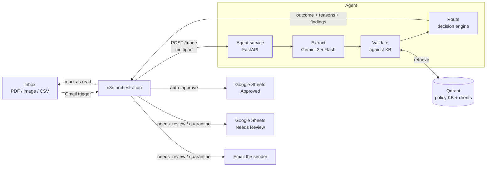

# Contract Intake & Triage Agent

> An agentic pipeline that ingests contracts from email, extracts structured data with a multimodal LLM, validates that data against an internal policy knowledge base (RAG), and routes each contract to automated storage or human review based on confidence and policy compliance.

**Stack:** Python · FastAPI · Gemini 2.5 Flash · Qdrant · n8n · Google Sheets · Docker Compose

---

## Why contracts?

The brief asked for a scenario that shows real thinking, where the knowledge base does genuine work rather than acting as decoration. Contracts fit well: every extracted clause is checked against an internal **contract playbook** (acceptable term ranges, approved jurisdictions, renewal-notice limits), and every counterparty is cross-referenced against a **known-clients** register. A contract is flagged *because* a specific retrieved policy says so — the RAG layer is the decision driver, not an add-on.

---

## How it works

```
Email + attachment  ─▶  Extraction  ─▶  RAG validation  ─▶  Triage decision  ─▶  Action
   (n8n Gmail trigger)   (Gemini)        (Qdrant + KB)       (decision engine)    (Sheets / email)
```

1. **Email intake.** An n8n Gmail trigger polls a dedicated inbox, downloads the attachment, and marks the message read. No public webhook is needed because the trigger polls.
2. **Extraction.** The attachment is sent to Gemini 2.5 Flash, which is natively multimodal — it reads clean PDFs, scanned/photographed images, and CSVs without a separate OCR step. The agent returns structured JSON where every field carries a `value`, a `confidence`, and a `source_snippet`.
3. **RAG validation.** Each extracted term is checked against the knowledge base in Qdrant: policy rules are retrieved by semantic similarity, and the counterparty is matched against the known-clients register (so aliases like "Acme Corp" still match "Acme Corporation Ltd").
4. **Triage decision.** A decision engine combines field completeness, per-field confidence, policy compliance, and counterparty status into one of three outcomes — `auto_approve`, `needs_review`, or `quarantine` — each with structured, human-readable reasons.
5. **Action.** Approved contracts are written to an "Approved" Google Sheet. Anything uncertain or non-compliant goes to a "Needs Review" sheet with the reasons attached, and the sender is emailed. Unreadable files are quarantined.

---

## Architecture



**Separation of concerns.** n8n owns orchestration and integrations (Gmail trigger, branching, Sheets, notifications). The Python agent owns the AI logic (extraction, RAG, the decision engine) and exposes it over HTTP. They communicate over the local Docker network. This keeps the testable, reviewable logic in code while still producing the n8n workflow export.

---

## Tech stack & why

| Layer | Choice | Why |
|---|---|---|
| LLM | Gemini 2.5 Flash | Generous free tier; **natively multimodal**, so scanned images and PDFs work without separate OCR. |
| Embeddings | `gemini-embedding-001` | Free; distinct document/query task types improve retrieval. |
| Vector store | Qdrant (self-hosted) | Open-source and free; runs in the same Compose file, no external account. |
| Orchestration | n8n (self-hosted) | Free; the visual workflow doubles as a deliverable. |
| Agent core | FastAPI + `google-genai` + `qdrant-client` | Clean, typed, unit-testable AI logic in Python, talking to each service directly. |
| Storage / action | Google Sheets | Free, instantly visible, demo-friendly. |
| Runtime | Docker Compose | One command brings up the whole system locally. |

> **Cost.** Everything runs under free tiers. The only external calls are to Gemini (free tier) and Google (Sheets/Gmail, via n8n). Keep billing **off** on the Google Cloud project used for the Gemini key — enabling billing removes the free tier. Use synthetic/sample contracts, since free-tier prompts may be used to improve Google's products.

---

## Extraction schema

The agent extracts a typed object (`agent/app/schemas.py`). Each field is wrapped as `{ value, confidence, source_snippet }`: counterparty (name, address), contract type, effective/end dates, renewal terms, payment terms, liability cap, governing law, termination notice, confidentiality duration, and signatories.

Returning a confidence score and a source snippet per field makes the output **auditable** and gives the triage engine a real signal to route on. The field descriptions in the schema double as extraction instructions, since the JSON schema is passed to the model.

---

## Knowledge base (RAG)

Loaded into Qdrant via `agent/scripts/ingest_kb.py`:

- **Contract playbook** (`knowledge_base/policies.yaml`) — natural-language rules: liability-cap minimums, renewal-notice limits, payment-term windows, approved governing-law jurisdictions, termination bounds, confidentiality duration.
- **Known clients** (`knowledge_base/known_clients.json`) — the approved counterparty register, matched by vector similarity so aliases and minor variations still resolve.

Retrieval drives the decision: a contract is flagged for review with the *specific policy id* behind each finding, so a reviewer sees exactly which rule was triggered.

---

## Triage logic

The decision engine (`agent/app/routing.py`) maps validation findings to one outcome:

| Outcome | Trigger | Action |
|---|---|---|
| `auto_approve` | All required fields present and confident, no policy violations, known counterparty | Write to **Approved** sheet |
| `needs_review` | Missing/low-confidence critical field, policy deviation, or unknown counterparty | Write to **Needs Review** sheet with reasons, email the sender |
| `quarantine` | File unreadable / not a contract / extraction failed | Logged as needs-review with a quarantine reason |

Every `needs_review` row carries the **specific** reasons, so a reviewer sees *why* without re-reading the contract.

---

## Handling things going wrong

Robustness is a first-class concern — the agent is fed untrusted email attachments and non-deterministic model output, and it degrades gracefully rather than discarding good work:

- **Untrusted uploads** are validated before anything reaches the model: MIME-type allowlist (415), size cap (413), empty-file guard (400).
- **Extraction failures** return a `quarantine` decision (HTTP 200), not a 5xx — the pipeline always produces a routable outcome instead of crashing.
- **Messy model output is absorbed, not rejected.** The schema tolerates the formats models actually emit: confidence given as a percentage (`95` → `0.95`) or out of range is normalised; non-ISO dates (`"15 January 2026"`) are kept as strings; enum case/format variants (`"NDA"`, `"Auto"`) resolve with safe fallbacks; numbers embedded in text (`"Net-30"`, `"ninety (90) days"`) are parsed out; signatory objects are flattened to strings; and a field returned as `null` instead of an object becomes an empty field rather than failing the whole extraction.
- **Confidence gating.** Fields below a confidence threshold are not validated against policy — a guess shouldn't produce a spurious violation; it routes to human review instead.
- **Diagnosability.** Schema-validation failures log the exact offending field and value, and empty model responses log the model's finish reason.
- **Transient errors.** The Gemini SDK retries; a momentary `503` (model overloaded) is surfaced cleanly and can be retried.

---

## Repository structure

```
contract-intake-agent/
├── README.md
├── LICENSE
├── .gitignore
├── .env.example
├── docker-compose.yml
├── n8n/
│   └── workflow.json            # exported from the running instance
├── agent/
│   ├── Dockerfile
│   ├── pyproject.toml           # pytest config
│   ├── requirements.txt / requirements-dev.txt
│   ├── app/
│   │   ├── main.py              # FastAPI: /health, /extract, /triage
│   │   ├── schemas.py           # extraction domain model (+ lenient coercion)
│   │   ├── extraction.py        # Extractor interface + Gemini implementation
│   │   ├── embeddings.py        # Embeddings interface + Gemini implementation
│   │   ├── vectorstore.py       # VectorStore repository + Qdrant implementation
│   │   ├── knowledge_base.py    # retrieval facade (policies + clients)
│   │   ├── kb_ingest.py         # KB loading / ingestion logic
│   │   ├── validator.py         # extraction -> findings
│   │   ├── routing.py           # findings -> triage decision
│   │   ├── api_models.py        # HTTP response DTOs
│   │   └── config.py            # settings (env)
│   ├── knowledge_base/          # policies.yaml, known_clients.json
│   ├── scripts/ingest_kb.py     # CLI: load KB into Qdrant
│   └── tests/                   # 47 tests
├── sample_data/                 # the 3 demo contracts + README
└── docs/
    └── n8n-setup.md             # n8n credential + node configuration guide
```

---

## Getting started

### Prerequisites (Windows 11 / macOS / Linux)
- **Docker Desktop** (WSL2 backend on Windows).
- A **Gemini API key** from Google AI Studio (dedicated project, billing off).
- A **Google account** for the Gmail intake inbox and the Sheets output (configured inside n8n — see below).

### Run the agent stack
```bash
git clone https://github.com/<you>/contract-intake-agent.git
cd contract-intake-agent
cp .env.example .env          # add your GEMINI_API_KEY (and ORGANISATION_NAME)
docker compose up -d --build
docker compose exec agent python -m scripts.ingest_kb   # load the knowledge base
```

This starts `agent` (http://localhost:8000), `qdrant` (http://localhost:6333), and `n8n` (http://localhost:5678). Verify the agent at http://localhost:8000/docs.

### Configuration
| Variable | Purpose |
|---|---|
| `GEMINI_API_KEY` | Gemini API access (required) |
| `ORGANISATION_NAME` | Your company name; the model treats the *other* party as the counterparty |
| `QDRANT_URL` | Defaults to the in-Compose Qdrant service |

> Google credentials (Gmail, Sheets) live **inside n8n**, not in the agent's `.env`. See `docs/n8n-setup.md`.

### Wire up n8n
Follow `docs/n8n-setup.md`: import `n8n/workflow.json`, connect Gmail and Google Sheets OAuth credentials, create the two-tab sheet, and activate the workflow.

---

## API

| Endpoint | Purpose |
|---|---|
| `GET /health` | Liveness probe |
| `POST /extract` | Extraction only — returns a `ContractExtraction` |
| `POST /triage` | Full pipeline — extract → validate → route; returns outcome, reasons, extraction, findings |

---

## Demo

The three sample contracts in `sample_data/` each exercise a different path:

1. **`contract_1_compliant_nda.pdf`** (digital PDF) → `auto_approve` — known client, every term in policy.
2. **`contract_2_violations_scan.jpg`** (scanned image) → `needs_review` — vision on a skewed scan; unknown counterparty plus four policy violations.
3. **`contract_3_incomplete_letter.pdf`** (sparse PDF) → `needs_review` — missing critical fields handled gracefully.

---

## Design decisions & trade-offs

- **Hybrid n8n + Python**, not no-code only — keeps the gradable logic in clean, tested code while still delivering a workflow export.
- **Organisation identity** — "counterparty" is meaningless until the agent knows which party is *us*. `ORGANISATION_NAME` is woven into the prompt so the model extracts the other party reliably, and it's configurable per deployment.
- **JSON mode + local validation over server-side structured output** — the schema uses a generic `ExtractedField[T]` wrapper (which compiles to `$ref`/`$defs`); running the model in JSON mode with the schema in the prompt and validating with Pydantic is robust to that complexity and keeps validation in our control.
- **Thinking disabled for extraction** — a deterministic structured task doesn't need extended thinking, and disabling it (`thinking_budget=0`) keeps the full output budget for the JSON.
- **Self-hosted Qdrant over a managed free tier** — fully self-contained, no inactivity suspension.
- **Interfaces at the seams** — `Extractor`, `Embeddings`, and `VectorStore` are protocols, so tests run against an in-memory Qdrant and a stub embedder with no network and no model calls.

---

## Testing

```bash
cd agent
pip install -r requirements-dev.txt
pytest
```

47 tests cover the schema (including every leniency path), extraction error handling, the knowledge base and retrieval (real Qdrant in-memory), the validator, the routing engine, and the API endpoints.

---

## With more time
- A lightweight review UI instead of a Sheets tab.
- A labelled evaluation set to measure extraction accuracy over time.
- Confidence calibration from reviewer feedback.

---

## License

MIT — see [LICENSE](LICENSE).